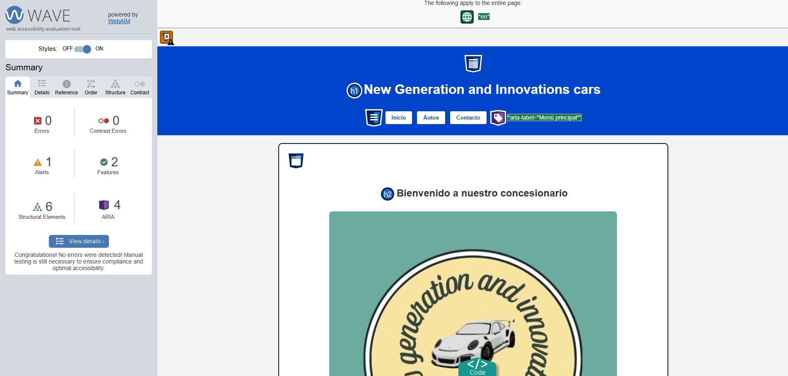

#  Concesionario SPA — Natan Hernandez

##  Proyecto React
Esta aplicación es una single page application que se desarrollada en React para simular un concesionario de autos llamado new generation and innovations cars; Esta pagina dirigida a usuarios que desean conocer distintos modelos de vehículos disponibles en el concesionario y ponerse en contacto con nuestro concesionario para solicitar información.

---

##  Propósito y público objetivo
como objetivos para este proyecto tenemos lo siguiente:
- Conocer distintos modelos de vehículos disponibles en el concesionario.
- Visualizar informacion general y especifica  de cada vehiculo.
- Ponerse en contacto mediante un formulario accesible.

Está dirigida a todo el publico  con el fin de que todas las personas puedan tener accesibilidad a esta, cumpliendo criterios de WCAG 2.1  y uso de frameworks como reac, en mi caso usando  node.js y react para la navegacion sin recarga y la accesibilidad creada con react

---

##  Requisitos de accesibilidad aplicados
En este proyecto se  aplicaron las pautas de accesibilidad WCAG 2.1:

-  Los colores con contraste para texto y botones.  
-  Tipografía legible y tamaño adecuado para el usuario.  
-  Navegación clara.  
- Uso de atributos ARIA como el aria-label o aria-labelledby.  
- Imágenes con texto usando alt.  
- Formularios con mensajes de error como el role alert para los lectortes de pantalla y anunciar automaticamente la informacion necesaria para ese caso. 
- HTML semántico: uso de header,nav,main,section,footer.  
- SPA con navegación interna sin recargar la página.  

---

## Guía de usuario accesible
este SPa esta creado para rodo el publico

### Navegación con teclado
- Tab - avanzar al siguiente elemento interactivo.  
- Shift - Tab - retroceder al elemento anterior.  
- Enter - activar enlaces o botones seleccionados.  

### Uso con lectores de pantalla
- El lector de pantalla anunciará:
- Los **títulos y secciones principales** de la página.  
- Los **mensajes de error** del formulario como los campos obligatorios de relleno  

### Accesibilidad visual
- Colores con contraste   
- Texto en tipografía clara y tamaños legibles  

---

## Desarrollo de la SPA
- **Framework:** React.  
- **Estructura semántica:** header,nav, main,section, footer.  
- **Navegación interna:** SPA con react sin recarga de página.  
- **Accesibilidad:** atributos ARIA, roles semánticos, en imágenes, mensajes de error accesibles.  

---

## Informe de pruebas de accesibilidad

###Herramientas utilizadas
- WAVE
  
- Lighthouse.  
- Pruebas manuales de navegación con teclado y lector de pantalla.  

---

### Problemas detectados y soluciones aplicadas
| Problema detectado | Solución aplicada |
|--------------------|------------------|
| Falta de enfoque visible al navegar con Tab | Se mantuvieron los estilos focus en botones e inputs |
| Contraste insuficiente en botones (hover) | Se ajustaron colores (#0044cc y blanco) para contraste ≥ 4.5:1 |
| Imágenes sin descripción | Se agregaron textos alternativos (alt) descriptivos |
| Mensajes de error no accesibles | Se añadió role="alert y aria-describedby en cada campo |
| Estructura semántica incompleta | Se agregó role="main en main y aria-label en nav |

---

### Evidencia de pruebas
- WAVE   
- Lighthouse   
- Pruebas manuales  
- Formulario

---

##Scripts disponibles
En el directorio del proyecto puedes ejecutar:

- npm start- inicia la app en modo desarrollo.  
- npm run build - crea la versión optimizada para producción.  
- npm run deploy - despliega la app en GitHub Pages.  

